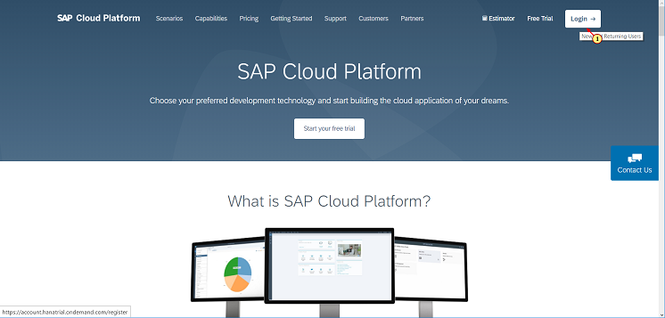
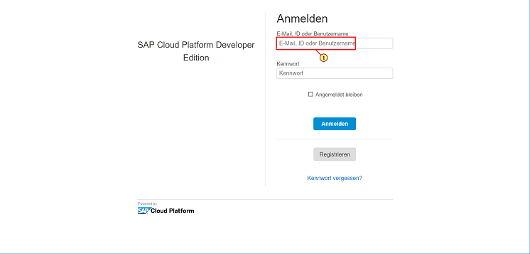

## Prerequisites

- **Tutorials:** [Sign up for a free trial account on SAP Cloud Platform](https://www.sap.com/developer/tutorials/hcp-create-trial-account.html) and [Enable SAP Cloud Platform Mobile Services](https://www.sap.com/developer/tutorials/fiori-ios-hcpms-setup.html)
- **SAP Mobile Cards:** Download and install on your [iPhone] (https://itunes.apple.com/us/app/sap-content-to-go/id1168110623?mt=8) or [Android] (https://play.google.com/store/apps/details?id=com.sap.content2go)

## Details

### You will learn

 - How to connect the SAP Mobile Cards Application to your SAP Cloud Platform Mobile Services trial account.

**Interactive version of this tutorial can be found [here](https://www.sap.com/germany/developer/tutorial-navigator/mobile-interactive-tutorials/content2go/setup.html)**

> Before you start, make sure you:

> - have downloaded & installed SAP Mobile Cards application on your iPhone or Android device
> - have a trial account on SAP Cloud Platform. See [Sign up for a free trial account on SAP Cloud Platform](https://www.sap.com/developer/tutorials/hcp-create-trial-account.html) for more information.
> - enabled SAP Cloud Platform Mobile Services. See [Enable SAP Cloud Platform Mobile Services](https://www.sap.com/developer/tutorials/fiori-ios-hcpms-setup.html) for more information.

---
[ACCORDION-BEGIN [Step 1: ](Mobile Cards setup in SAP Cloud Platform Mobile Services)]

\(1\) Open a browser with the URL : [https://cloudplatform.sap.com/index.html](https://cloudplatform.sap.com/index.html "")

and click  on  **Login**

\(2\) Enter your SAP Cloud Platform account credentials

\(3\) Click 

\(4\) Click 

![Home [Europe (Rot) - Trial] > Home - SAP Cloud Platform Cockpit - Opera](Markdown_files/img_002.png "Home [Europe Rot - Trial]  Home - SAP Cloud Platform Cockpit - Opera")

\(5\) Click .

![Home [Europe (Rot) - Trial] > Europe (Rot) - Trial > p1415968267trial > Overview - SAP Cloud Platform Cockpit - Opera](Markdown_files/img_003.png "Home [Europe Rot - Trial]  Europe Rot - Trial  p1415968267trial  Overview - SAP Cloud Platform Cockpit - Opera")

\(6\) Click 

![Home [Europe (Rot) - Trial] > Europe (Rot) - Trial > p1415968267trial > Services - SAP Cloud Platform Cockpit - Opera](Markdown_files/img_004.png "Home [Europe Rot - Trial]  Europe Rot - Trial  p1415968267trial  Services - SAP Cloud Platform Cockpit - Opera")

\(7\) Click 

![Home [Europe (Rot) - Trial] > Europe (Rot) - Trial > p1415968267trial > Services - SAP Cloud Platform Cockpit - Opera](Markdown_files/img_005.png "Home [Europe Rot - Trial]  Europe Rot - Trial  p1415968267trial  Services - SAP Cloud Platform Cockpit - Opera")

\(8\) Click here on  **Mobile Services**  tile

![Home [Europe (Rot) - Trial] > Europe (Rot) - Trial > p1415968267trial > Services - SAP Cloud Platform Cockpit - Opera](Markdown_files/img_006.png "Home [Europe Rot - Trial]  Europe Rot - Trial  p1415968267trial  Services - SAP Cloud Platform Cockpit - Opera")

\(9\) Click  to open the mobile services

![Home [Europe (Rot) - Trial] > Europe (Rot) - Trial > p1415968267trial > Development & Operations, std > Overview - SAP Cloud Platform Cockpit - Opera](Markdown_files/img_007.png "Home [Europe Rot - Trial]  Europe Rot - Trial  p1415968267trial  Development  Operations, std Overview - SAP Cloud Platform Cockpit - Opera")

[DONE]

[ACCORDION-END]

[ACCORDION-BEGIN [Step 2: ](Mobile Cards setup in SAP Cloud Platform Mobile Services)]

\(1\) Click 

\(2\) Click 

\(3\) Click 

\(4\) Click 

\(5\) Below is a list of destinations from which the SAP Mobile Cards service can fetch data. For the tutorials, the `SAPCPMobileServices` destination is used.  *Important is that all destinations are only pointing to the root of the service.*

\(6\) Click 

\(7\) Click here on  **APIs**

Follow the next steps to trigger the configuration of the SAP Mobile Cards client with this SAP Cloud Platform account. For this start scanning the QR code with your Phone's camera app.

\(8\) Click on the toast message to launch SAP Mobile Cards

the device will start the registration follow the next steps to authenticate

Enter your SAP Cloud Platform credentials and click on Logon to authenticate.

Click on  **Setup Later**  to skip setting a passcode for the SAP Mobile Cards client.

you now have connected your SAP Mobile Cards client with your SAP Cloud Platform account.

[VALIDATE_1]
[ACCORDION-END]

---
