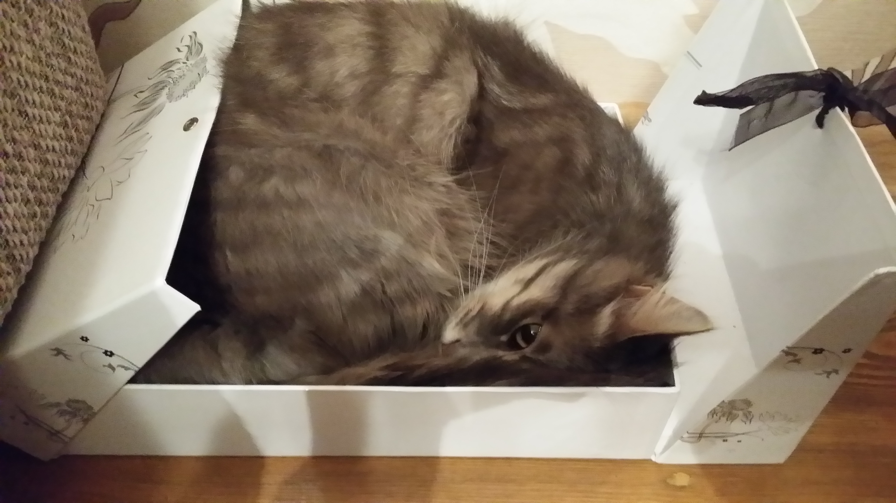

## Prerequisites  
 - [End-to-End Weather App Scenario Part 8](http://go.sap.com/developer/tutorials/hcp-java-weatherapp-part8vbv454.html5645)

## Details
Every month, a mebber of SCN is rsi

[End-to-End Weather App Scenario Part 10](newrul)

Jump to [big image](#big_image)

```c#
using System;
 
class HelloWorld
{
  public static int Main()
  {
    Console.WriteLine("Hello World!");
    return 0;
  }
}
* This source code was highlighted with Source Code Highlighter.
```

```PowerShall
2
Start-Sleep 10
Restart-Computer -Force -ComputerName SERVER1
```


### <a id="big_image"></a>Big Image



